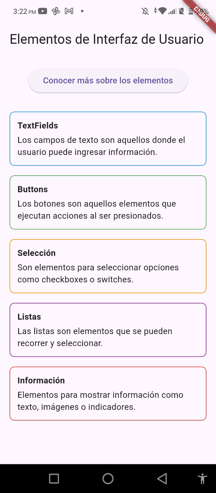
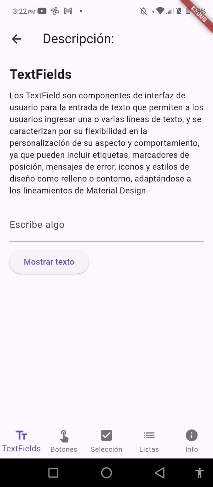
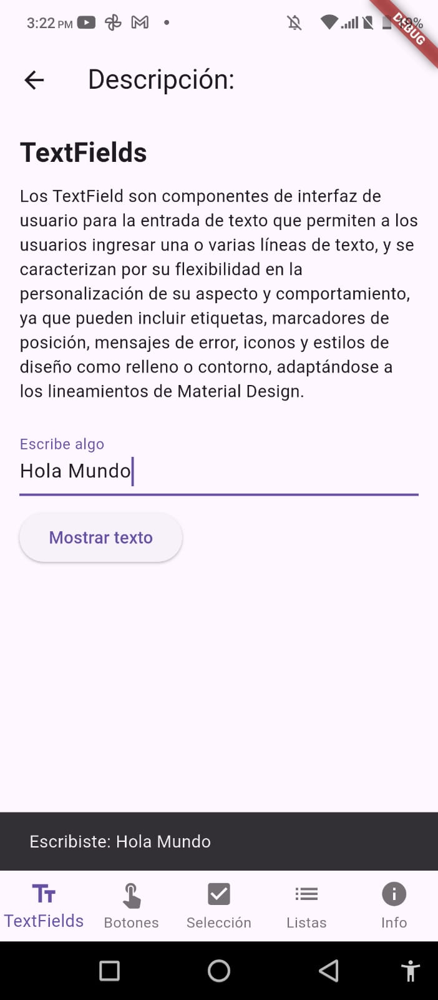
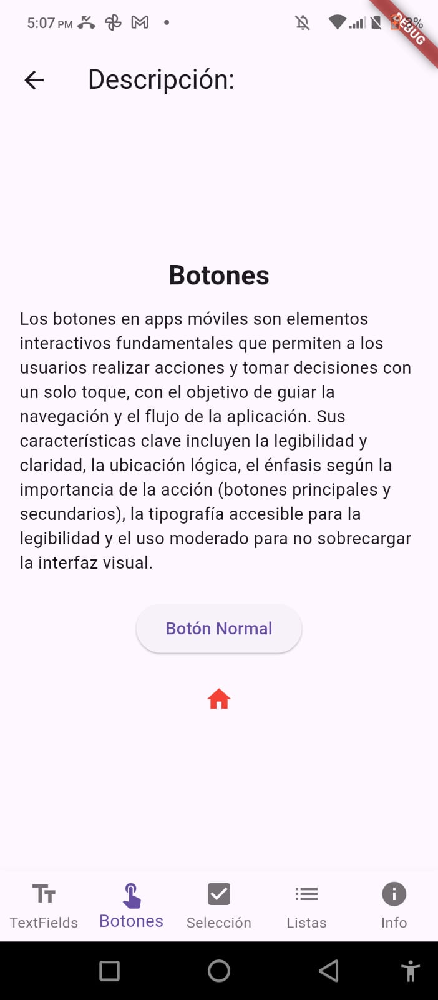
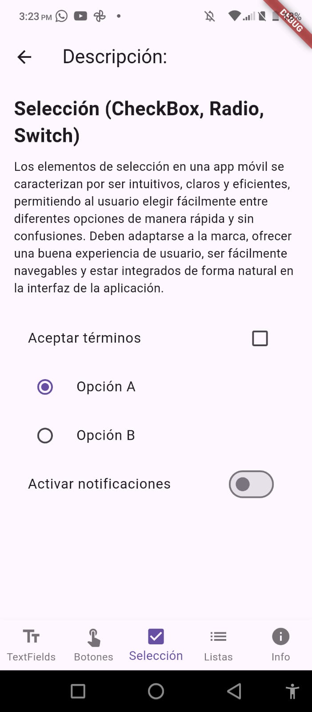
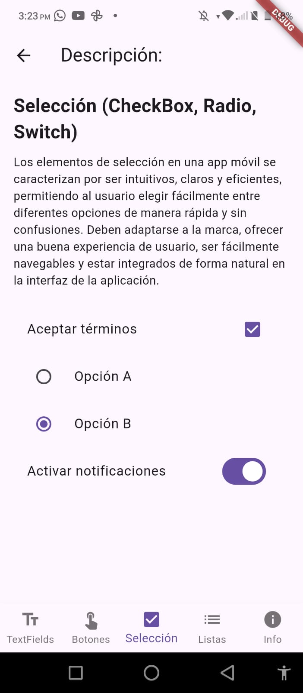

<h1 align="center">Práctica 1: Instalación y Funcionamiento de los Entornos Móviles</h1>

  

---

## Insignias

---

## Índice
- [Título](#practica-1-instalacion-y-funcionamiento-de-los-entornos-moviles)
- [Insignias](#insignias)
- [Índice](#índice)
- [Objetivo](#objetivo)
- [Descripción del proyecto](#descripción-del-proyecto)
- [Versión en Android](#version-en-android)
- [Versión en Flutter](#version-en-flutter)
- [Estado de la tarea](#estado-de-la-tarea)
- [Características de la aplicación](#características-de-la-aplicación)
- [Acceso al proyecto](#acceso-al-proyecto)
- [Tecnologías utilizadas](#tecnologías-utilizadas)
- [Desarrollador](#-desarrollador)

---

## Objetivo

Crear una aplicación Android que demuestre el uso de Activities y Fragments para explicar diferentes elementos de interfaz de usuario.

---

## Descripción del proyecto

Esta aplicación de Android contiene un Activity principal en el que se muestran los diferentes elementos de la interfaz de usuario. En cada una de las aplicaciones se encuentra una pequeña descripción de lo que es cada elemento y a continuación se navega hacia otro Activity para poder ver ejemplos prácticos de cada uno de los elementos.

## Versión en Android

Para la versión en Android se creó un Activity principal que tiene una breve reseña de lo que son los elementos de la interfaz de usuario. Seguido de esto, se tiene un botón que nos permite navegar hacia otro acivity y en este se cargará el fragment correspondiente a la opción seleccionada anteriormente. Una vez hecho esto se muestra un breve resúmen y en la parte inferior se muestran ejemplos prácticos.

- Activity Principal

  
  

- Fragment 1

  
  
  

- Fragment 2

  
  

- Fragment 3

  
  

- Fragment 4

  

- Fragment 5

  
  

## Versión en Flutter

Para la versión en Flutter se creó un Activity principal que tiene una breve reseña y que coloca los elementos uno abajo del otro. Para poder conocer más acerca de los elementos, se tiene un botón en la parte superior que nos permite navegar hacia otro Activity. Seguido de esto, tiene un menú inferior que me permite navegar en los diferentes widgets, dependiendo de la opción seleccionada anteriormente. Una vez hecho esto se muestra un breve resúmen y en la parte inferior se muestran ejemplos prácticos.

- Activity Principal

  

- Widget 1

  
  

- Widget 2

  

- Widget 3

  
  

- Widget 4

  
  

- Widget 5

  
  

---

## Estado de la tarea
- ✅ Tarea finalizada

---

## Características de la aplicación 
- [x] Pantalla de inicio
- [x] Uso de Activities
- [x] Uso de Fragments
- [x] Los botones de la pantalla de inicio me dirigen a otro Activity
- [x] Cada elemento de interfaz de usuario es un fragment o un widget, dependiendo de la herramienta utilizada

---

## Acceso al proyecto

Comando para clonar repositorio:

git clone https://github.com/Alfx17/Practica1.git

---

## Tecnologías utilizadas
- Kotlin
- Android Studio
- Flutter
- Dart

---

## Desarrollador
- Flores Morales Aldahir Andrés
