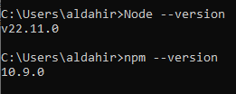
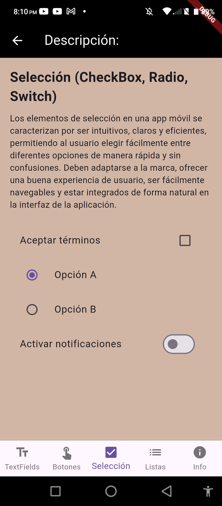

<h1 align="center">Práctica 1: Instalación y Funcionamiento de los Entornos Móviles</h1>

  

## Insignias

---

## Índice
- [Título](#practica-1-instalacion-y-funcionamiento-de-los-entornos-moviles)
- [Insignias](#insignias)
- [Índice](#índice)
- [Objetivo](#objetivo)
- [Descarga del entorno de programación](#descarga-del-entorno-de-programacion)
- [Instalación de Java Development Kit(JDK)](#instalacion-de-jdk)
- [Instalación de Maven](#instalacion-de-maven)
- [Instalación de Git](#instalacion-de-git)
- [Instalación de GitHub](#instalacion-de-github)
- [Instalación de Docker](#instalacion-de-docker)
- [Instalación de Node.js](#instalacion-de-node)
- [Instalación de Flutter](#instalacion-de-flutter)
- [Descripción del proyecto](#descripción-del-proyecto)
- [Versión en Android](#version-en-android)
- [Versión en Flutter](#version-en-flutter)
- [Estado de la tarea](#estado-de-la-tarea)
- [Características de la aplicación](#características-de-la-aplicación)
- [Acceso al proyecto](#acceso-al-proyecto)
- [Tecnologías utilizadas](#tecnologías-utilizadas)
- [Desarrollador](#-desarrollador)

---

## Objetivo

Crear una aplicación Android que demuestre el uso de Activities y Fragments para explicar diferentes elementos de interfaz de usuario.

---

## Descarga del entorno de programación 
Para instalar Android Studio en Windows, se siguen estos pasos:
- Descomprimir el Zip.
- Copiar la carpeta android-studio en la carpeta Archivos de programa.
- Abrir la carpeta android-studio > bin.
- Iniciar studio64.exe (para máquinas de 64 bits).
- Seguir los pasos del Setup Wizard en Android Studio y, luego, instalar los paquetes de SDK recomendados.
- Una vez realizados los pasos anteriores, se deberá ejecutar el instalador y realizar las configuraciones correspondientes para instalarlo correctamente.

  
  

Para verificar el correcto funcionamiento del entorno, se creó la aplicación "Hello Android" para observar el funcionamiento del emulador descargado.

  

---

## Instalación de Java Development Kit(JDK)

- Descargue un .msiarchivo de Windows desde la página de Descargas.
- Haga doble clic en el archivo .msi para iniciar el asistente de instalación.
- Siga los pasos del asistente.
- Tiene la opción de configurar una ruta de instalación personalizada. De forma predeterminada, Amazon Corretto 21 se instala en [nombre del dominio C:\Program Files\Amazon Corretto\]. Si configura una ruta personalizada, anótela para el siguiente paso.
- Una vez finalizado el asistente de instalación, configure las variables de entorno JAVA_HOMEy .PATH
- Establezca JAVA_HOME la ubicación de instalación, teniendo en cuenta que el directorio contiene la versión instalada. Por ejemplo, si el directorio predeterminado es 21.0.8, configúrelo JAVA_HOME como C:\Program Files\Amazon Corretto\jdk21.0.8_9.
- Añadir %JAVA_HOME%\bina la PATH variable actual.
- Verifique la instalación ejecutando java -version en el símbolo del sistema. Debería ver el siguiente resultado.
En mi caso se realizó una actualización cambiando mis variables de entorno, ya que tenía instalado JDK 18.

  
  

---

## Instalación de Maven

Instalación:

Apache Maven se puede instalar mediante la mayoría de los administradores de paquetes o manualmente descargando el archivo y agregándolo a su ruta.

Prerrequisitos: 

Necesita tener instalado el Kit de Desarrollo de Java (JDK). Configure la JAVA_HOME variable de entorno con la ruta de instalación del JDK o tenga el javaejecutable en su PATH.
La versión estable actual 3.9.11requiere JDK 8+, pero cualquier versión reciente funcionará bien.

Distribución binaria:
- Para instalar Apache Maven, extraiga el archivo y añada su directorio bin al archivo PATH. Esto funciona en cualquier sistema operativo, pero la configuración de la ruta y las variables de entorno depende del sistema operativo.

Los pasos detallados son:
- Descargue el archivo de distribución binaria de Apache Maven .
- Extraiga el archivo de distribución en cualquier directorio. Use unzip apache-maven-3.9.11-bin.zip o tar xzvf apache-maven-3.9.11-bin.tar.gzsegún el archivo.
- Añade el bindirectorio del directorio creado apache-maven-3.9.11a la PATHvariable de entorno
- Confirmar con mvn -vun nuevo shell.

A continuación se muestra que el comando ya está funcionando:

  

---

## Instalación de Git

Instalar Git en Windows implica los siguientes pasos:

- Descarga el instalador de Windows
- Ejecuta el instalador
- Verifica la instalación

Paso 1: Descarga el Instalador de Windows
- Visita la página oficial de Git para descargar la última versión del instalador de Git para Windows. La descarga debería iniciarse automáticamente cuando visites la página.
- Descargar Git para Windows.

Paso 2: Ejecuta el Instalador y Selecciona las Opciones
- Ejecuta el instalador descargado y sigue el asistente de instalación. Confirma que la aplicación puede realizar cambios en tu dispositivo haciendo clic en Sí en el cuadro de diálogo Control de Cuentas de Usuario que aparece.
- Lee la Licencia Pública General GNU y, cuando estés preparado para instalar, haz clic en Siguiente.
- Acepta la licencia GNU.
- El instalador te pedirá una ubicación para la instalación. Mantén la predeterminada a menos que necesites cambiarla, y haz clic en Siguiente.
- Selecciona la ubicación de destino para Git en tu ordenador.
- Aparecerá una pantalla de selección de componentes. Mantén la configuración por defecto a menos que necesites modificarla, y haz clic en Siguiente.
- Selecciona los componentes que quieras instalar con Git.
- Elige un editor de texto para utilizar con Git. Haz clic en el menú desplegable para elegir el editor de texto que quieras utilizar, como Vim, Notepad++, etc. y haz clic en Siguiente.

Paso 3: Verifica la instalación con Git Bash
- En este siguiente paso, puedes optar por renombrar tu rama inicial. Por defecto es master. Deja el predeterminado (a menos que realmente quieras cambiarlo) y haz clic en Siguiente.
- Para asegurarte de que Git se ha instalado correctamente, abre Git Bash y escribe el siguiente comando: git --version

  

---

## Instalación de GitHub

Puedes instalar GitHub Desktop en Windows 10 de 64 bits o posterior, pero debes tener un sistema operativo de 64 bits para ejecutar GitHub Desktop.
Pasos para instalarlo:
- Visite la página de descarga de GitHub Desktop.
- Haz clic en Descargar para Windows.
- En la carpeta Downloads del equipo, haz doble clic en el archivo de configuración de GitHub Desktop .
- GitHub Desktop se lanzará después de que se complete la instalación.

  

---

## Instalación de Docker
Instalar de forma interactiva:
- Descargue el instalador utilizando el botón de descarga en la parte superior de la página o desde las notas de la versión .
- Haga doble clic Docker Desktop Installer.exepara ejecutar el instalador. Docker Desktop se instala de forma predeterminada en C:\Program Files\Docker\Docker.
- Cuando se le solicite, asegúrese de que la opción Usar WSL 2 en lugar de Hyper-V en la página Configuración esté seleccionada o no, según su elección de backend.
- En los sistemas que solo admiten un backend, Docker Desktop selecciona automáticamente la opción disponible.
- Siga las instrucciones del asistente de instalación para autorizar al instalador y continuar con la instalación.
- Cuando la instalación sea exitosa, seleccione Cerrar para completar el proceso de instalación.
- Inicie Docker Desktop .

  
  

---

## Instalación de Node.js

1. Descargar el Instalador de Windows: En primer lugar, es necesario descargar el archivo de instalación de Windows Installer (.msi) del sitio web oficial de Node.js. Esta base de datos del instalador MSI lleva una colección de archivos de instalación esenciales para instalar, actualizar o modificar la versión existente de Node.js.
2. Comenzar el Proceso de Instalación: Una vez que abras y ejecutes el archivo .msi, comenzará el proceso de instalación. El instalador te pedirá que aceptes el acuerdo de licencia de Node.js. Para seguir adelante, marca la casilla «Acepto» y haz clic en Siguiente: Aceptar el acuerdo de licencia de Node.js.
3. Ejecutar la Instalación de Node.js en Windows: Por último, y esta es la parte más fácil de todas, haz clic en el botón Instalar para comenzar el proceso de instalación. El sistema completará la instalación en unos segundos o minutos y te mostrará un mensaje de éxito. Haz clic en el botón Finalizar para cerrar el instalador de Node.js.
4. Verificar la Instalación de Node.js: El proceso de instalación se ha completado. Ahora, tienes que comprobar si Node.js se ha instalado con éxito o no. Para verificar la instalación y confirmar si se ha instalado la versión correcta, abre la línea de comandos de tu PC e introduce el siguiente comando:
Node --version
Y para comprobar la versión de npm, ejecuta este comando:
npm --version

  

---

## Instalación de Flutter
Pasos para descargar Flutter: 
- Lanzar VS Code: Si aún no está abierto, abra VS Code buscándolo con Spotlight o abriéndolo manualmente desde el directorio donde está instalado.
- Añade la extensión Flutter a VS Code: Para agregar las extensiones de Dart y Flutter a VS Code, visita la página del marketplace de extensiones de Flutter y haz clic en " Instalar" . Si tu navegador lo solicita, permite que se abra VS Code.
- Instalar Flutter con VS Code.
- Abra la paleta de comandos en VS Code: Vaya a Ver > Paleta de comandos o presione Control+ Shift+ P. En la paleta de comandos, escriba flutter.
- Seleccione Flutter: Nuevo proyecto .
- VS Code te pide que busques el SDK de Flutter en tu computadora. Selecciona "Descargar SDK": Cuando aparezca el cuadro de diálogo Seleccionar carpeta para Flutter SDK , elija dónde desea instalar Flutter.
- Haga clic en Clonar Flutter .
- Al descargar Flutter, VS Code muestra esta notificación emergente: Downloading the Flutter SDK. This may take a few minutes.
- Haga clic en Agregar SDK a PATH.
- Cuando tenga éxito, aparecerá una notificación: The Flutter SDK was added to your PATH content_copy.
- Para garantizar que Flutter esté disponible en todas las terminales: Cierre y vuelva a abrir todas las ventanas de terminal.
- Reiniciar VS Code.

  

---

## Descripción del proyecto

Esta aplicación de Android contiene un Activity principal en el que se muestran los diferentes elementos de la interfaz de usuario. En cada una de las aplicaciones se encuentra una pequeña descripción de lo que es cada elemento y a continuación se navega hacia otro Activity para poder ver ejemplos prácticos de cada uno de los elementos.

---

## Versión en Android

Para la versión en Android se creó un Activity principal que tiene una breve reseña de lo que son los elementos de la interfaz de usuario. Seguido de esto, se tiene un botón que nos permite navegar hacia otro acivity y en este se cargará el fragment correspondiente a la opción seleccionada anteriormente. Una vez hecho esto se muestra un breve resúmen y en la parte inferior se muestran ejemplos prácticos.

- Activity Principal

  
  

- Fragment 1

  
  
  

- Fragment 2

  
  

- Fragment 3

  
  

- Fragment 4

  

- Fragment 5

  
  

---

## Versión en Flutter

Para la versión en Flutter se creó un Activity principal que tiene una breve reseña y que coloca los elementos uno abajo del otro. Para poder conocer más acerca de los elementos, se tiene un botón en la parte superior que nos permite navegar hacia otro Activity. Seguido de esto, tiene un menú inferior que me permite navegar en los diferentes widgets, dependiendo de la opción seleccionada anteriormente. Una vez hecho esto se muestra un breve resúmen y en la parte inferior se muestran ejemplos prácticos.

- Activity Principal

  

- Widget 1

  
  

- Widget 2

  

- Widget 3

  
  

- Widget 4

  
  

- Widget 5

  
  

---

## Estado de la tarea
- ✅ Tarea finalizada

---

## Características de la aplicación 
- [x] Pantalla de inicio
- [x] Uso de Activities
- [x] Uso de Fragments
- [x] Los botones de la pantalla de inicio me dirigen a otro Activity
- [x] Cada elemento de interfaz de usuario es un fragment o un widget, dependiendo de la herramienta utilizada

---

## Acceso al proyecto

Comando para clonar repositorio:

git clone https://github.com/Alfx17/Practica1.git

---

## Tecnologías utilizadas
- Kotlin
- Android Studio
- Flutter
- Dart

---

## Desarrollador
- Flores Morales Aldahir Andrés
